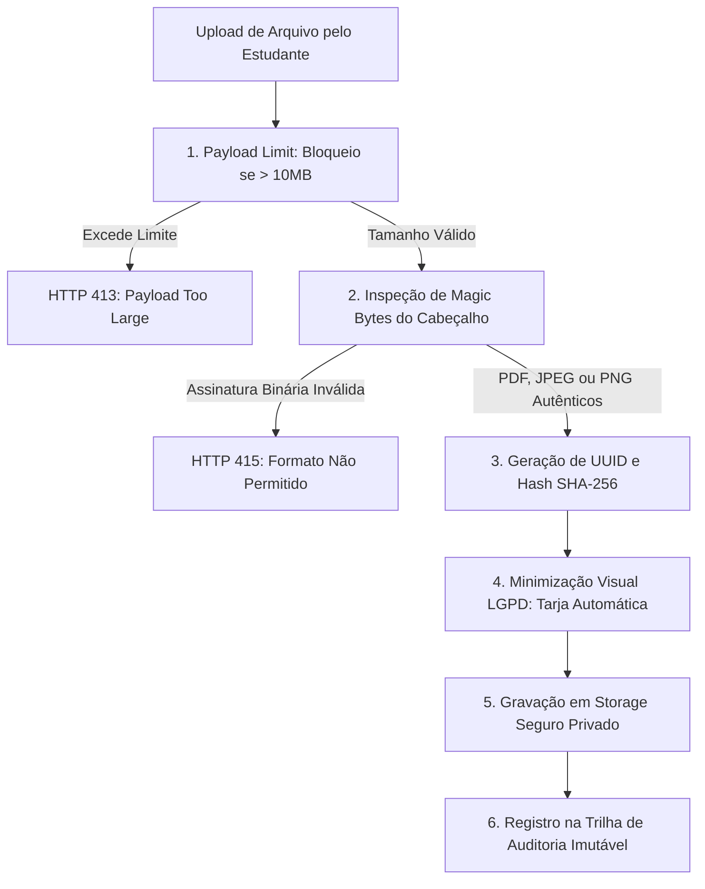

# 📄 DocFlow — Documentação de Arquitetura e Especificação Técnica

> **DocFlow** é uma plataforma B2B SaaS desenvolvida para centralizar, gerenciar e assegurar a guarda contínua de documentos organizacionais de aprendizes e estagiários (RG, CPF, Comprovante de Residência, Comprovante de Matrícula e Contrato de Trabalho/TCE), estruturada sob o padrão arquitetural **DDD Lite (Domain-Driven Design)**, com backend em **Python (FastAPI)**, frontend corporativo em **Next.js (React/Tailwind CSS)** e rigorosa conformidade com a **LGPD**.

---

## 1. Visão Geral do Sistema & Proposta de Valor

No ciclo de vida pós-contratação de aprendizes e estagiários, a guarda de documentos organizacionais enfrenta desafios regulatórios e operacionais críticos:
1. **Riscos e Sanções LGPD**: Exposição excessiva de dados pessoais sensíveis (como filiação e dados biométricos) em vias públicas ou canais desprotegidos.
2. **Cancelamento de Contratos de Estágio**: Perda de prazos na renovação de comprovantes de matrícula semestrais, acarretando penalizações ou anulação do vínculo do estudante.
3. **Ausência de Trilha de Auditoria**: Falta de rastreabilidade forense sobre quem visualizou, aprovou, baixou ou rejeitou documentos confidenciais.
4. **Ameaças Digitais**: Risco de upload de scripts maliciosos camuflados em extensões de arquivo comuns.

O **DocFlow** soluciona esses gargalos através de um isolamento de camadas orientado ao domínio (**DDD Lite**), guard-rails automáticos de segurança e dashboards analíticos de conformidade acadêmica por turma.

---

## 2. Arquitetura de Software: Padrão DDD Lite (Domain-Driven Design)

O sistema adota o padrão **DDD Lite**, organizando o código em camadas estritamente desacopladas para garantir que as regras de negócio permaneçam puras, testáveis e independentes de frameworks de infraestrutura ou bancos de dados.

```
DocFlow/
├── backend/
│   ├── app/
│   │   ├── domain/                 # 1. CAMADA DE DOMÍNIO (Regras Puras)
│   │   │   ├── entities/           # Entidades: Student, Document, Dossier, AuditLog, Turma, Tenant
│   │   │   ├── value_objects/      # Value Objects: CPF, DocumentValidity, FileHash, Email
│   │   │   ├── enums/              # StatusDocumento, TipoDocumento, NivelRisco, PerfilUsuario
│   │   │   ├── exceptions/         # Exceções de Domínio (ex: DocumentoExpiradoException)
│   │   │   └── repositories/       # Interfaces abstratas dos Repositórios (Contratos)
│   │   │
│   │   ├── application/            # 2. CAMADA DE APLICAÇÃO (Casos de Uso)
│   │   │   ├── use_cases/          # Casos de Uso Orquestradores:
│   │   │   │   ├── upload_document.py
│   │   │   │   ├── validate_document.py
│   │   │   │   ├── anonymize_lgpd.py
│   │   │   │   ├── generate_turma_dashboard.py
│   │   │   │   └── export_dossier_bulk.py
│   │   │   ├── dtos/               # Data Transfer Objects (Entrada/Saída dos Casos de Uso)
│   │   │   └── security/           # Guard-rails: MagicBytesValidator, PayloadLimitGuard
│   │   │
│   │   └── infrastructure/         # 3. CAMADA DE INFRAESTRUTURA (Tecnologias & Frameworks)
│   │       ├── api/                # Controladores Web API FastAPI (Rotas v1, Dependency Injection)
│   │       ├── database/           # Implementação dos Repositórios (SQLAlchemy / PostgreSQL / SQLite)
│   │       ├── storage/            # Provedor de Armazenamento Seguro (UUID Criptográfico fora do Web Root)
│   │       ├── audit/              # Gravador da Trilha de Auditoria Imutável (Append-Only)
│   │       └── redaction/          # Processamento visual para tarjamento automático LGPD (PyMuPDF/Pillow)
│   │
│   ├── tests/                      # Testes Unitários de Domínio e Integração de Casos de Uso
│   └── requirements.txt
│
└── frontend/                       # Interface do Usuário (Next.js, Tailwind CSS, TypeScript)
    ├── src/
    │   ├── app/                    # Rotas da Aplicação (App Router)
    │   │   ├── (student)/          # Checklist do Estudante & Upload
    │   │   ├── (coordinator)/      # Dossiês & Validador de Documentos
    │   │   ├── (analytics)/        # Dashboard de Encaminhamento Acadêmico
    │   │   └── (audit)/            # Consulta da Trilha de Auditoria LGPD
    │   ├── components/             # Componentes de UI (Sidebar, Viewer de Dossiê, Modais)
    │   └── lib/                    # Tipagens TypeScript e Clientes de API
    └── package.json
```

---

### 2.1. Detalhamento das Camadas DDD Lite

#### A. Camada de Domínio (`Domain`)
Representa o núcleo do sistema, contendo todas as regras de negócio e conceitos essenciais sem nenhuma dependência do FastAPI ou do banco de dados:
- **Entidades**:
  - `Student`: Representa o aprendiz/estagiário, contendo sua matrícula, dados de contato e coleção de documentos do dossiê.
  - `Document`: Entidade com ciclo de vida próprio (*Pendente*, *Em Análise*, *Aprovado*, *Recusado*, *Expirado*), metadados de armazenamento e hash de integridade.
  - `Dossier`: Agregação documental que calcula a taxa percentual de conformidade da pasta digital.
  - `AuditLog`: Registro imutável de evento de tratamento de dados.
- **Value Objects (Objetos de Valor)**:
  - `CPF`: Imutável, auto-validável através do cálculo dos dígitos verificadores.
  - `DocumentValidity`: Controla a expiração de comprovantes de matrícula semestrais e notifica renovações com base na data limite.
  - `FileHash`: Hash criptográfico SHA-256 para garantia de integridade do arquivo.
- **Interfaces de Repositório (`IRepository`)**:
  - Contratos abstratos (`IStudentRepository`, `IDocumentRepository`, `IAuditLogRepository`) que desacoplam o domínio da implementação do banco de dados.

#### B. Camada de Aplicação (`Application`)
Orquestra os fluxos de execução do sistema através de Casos de Uso (*Use Cases*) puros:
- `UploadDocumentUseCase`: Executa a validação de Magic Bytes, cálculo de hash, gravação por UUID e disparo do evento de auditoria.
- `ValidateDocumentUseCase`: Executa a aprovação ou recusa com justificativa obrigatória por parte do Coordenador/RH.
- `AnonymizeLGPDUseCase`: Executa o algoritmo de minimização e tarjamento visual sobre dados sensíveis não essenciais.
- `GenerateTurmaDashboardUseCase`: Agrega os dossiês dos alunos matriculados em uma turma, calculando o percentual de conformidade e o nível de risco de cancelamento contratual.

#### C. Camada de Infraestrutura (`Infrastructure`)
Responsável pelas implementações técnicas concretas:
- **Web API FastAPI**: Recebe requisições HTTP, valida payloads com Pydantic e injeta os casos de uso correspondentes.
- **Persistência SQLAlchemy**: Mapeamento objeto-relacional dos modelos de dados com isolamento multi-tenancy.
- **Storage Seguro Privado**: Gravação física em diretório privado protegido contra acesso web direto.
- **Audit Logger**: Módulo append-only de gravação contínua de logs sem suporte a alterações ou exclusões.

---

## 3. Matriz RBAC (Role-Based Access Control)

| Papel | Descrição | Permissões no Sistema |
|---|---|---|
| 🎓 **Estudante** *(Aprendiz / Estagiário)* | Titular dos dados cadastrais e acadêmicos | Upload de arquivos, acompanhamento do checklist de regularidade e recebimento de alertas de renovação semestral. |
| 📋 **Coordenador de Curso** | Gestor acadêmico da Instituição de Ensino | Análise dos dossiês digitais, aprovação/recusa fundamentada e monitoramento do dashboard analítico por turma. |
| 🏢 **Gestor de RH (Tenant)** | Representante da Empresa Contratante | Download em lote de dossiês regulares, consulta de compliance contratual e gestão de vagas. |
| 🛡️ **DPO / Oficial de Privacidade** | Encarregado de Proteção de Dados | Acesso irrestrito à trilha de auditoria imutável, conferência de integridade de logs e gestão de solicitações LGPD. |

---

## 4. Guard-Rails de Segurança & Conformidade LGPD



### 4.1. Inspeção Rigorosa de Magic Bytes
Para neutralizar riscos de scripts maliciosos disfarçados de documentos comuns, o sistema ignora a extensão enviada e analisa a assinatura binária dos primeiros bytes do arquivo:
- **PDF**: `%PDF-` (`0x25 0x50 0x44 0x46`)
- **JPEG**: `0xFF 0xD8 0xFF`
- **PNG**: `0x89 0x50 0x4E 0x47`

### 4.2. Limitação Estrita de Payload (10 MB)
Bloqueio imediato na camada de middleware para requisições com tamanho superior a 10 MB, evitando sobrecarga de memória e ataques de negação de serviço (DoS).

### 4.3. Isolamento de Storage & Nomes em UUID
Nenhum arquivo mantém seu nome original em disco. Todos os arquivos são renomeados para identificadores criptográficos únicos (`doc_<UUIDv4>.<ext>`) e armazenados fora da pasta pública do servidor web.

### 4.4. Minimização e Tarjamento Automático (LGPD Art. 6º, III)
Aplicação automática de tarja opaca sobre dados pessoais não indispensáveis (ex: filiação no RG, dados biométricos secundários) antes do arquivamento e visualização, limitando o tratamento ao mínimo estritamente necessário.

### 4.5. Trilha de Auditoria Imutável (Append-Only Log)
Cada ação executada na plataforma gera um registro gravado em tabela append-only com os seguintes metadados obrigatórios:
- `timestamp_utc`: Data e hora exatas com precisão de milissegundos;
- `user_id` e `user_role`: Identificação de quem realizou a operação;
- `action`: Ex: `DOCUMENT_UPLOAD`, `DOCUMENT_APPROVAL`, `DOCUMENT_REJECTION`, `LGPD_AUTO_REDACT`, `DOWNLOAD_DOSSIE`;
- `resource_id`: Identificador único do documento ou do aprendiz acessado;
- `ip_address`: Endereço IP de origem da requisição;
- `status`: Resultado da operação (`SUCCESS` ou `FAILURE`).

---

## 5. Módulos Funcionais do Sistema

### 🎓 1. Módulo do Estudante
- **Checklist Dinâmico**: Visualização clara do status de cada documento obrigatório (RG, CPF, Comprovante de Residência, Comprovante de Matrícula, Contrato/TCE).
- **Notificação de Renovação**: Alertas proativos com contagem regressiva para comprovantes semestrais prestes a vencer.
- **Upload Seguro**: Interface de envio com validação imediata.

### 📋 2. Módulo do Coordenador & RH
- **Dossiê Digital Centralizado**: Estrutura *Master-Detail* para busca e navegação rápida entre aprendizes.
- **Visualizador de Dossiê**: Visualização em alta resolução com opção de ativação da tarja LGPD.
- **Validação Ágil**: Fluxo de aprovação em lote ou recusa com justificativa obrigatória enviada ao estudante.

### 📊 3. Dashboard de Encaminhamento Acadêmico por Turma
- **KPIs Estratégicos**: Taxa geral de conformidade, total de dossiês 100% regulares e contagem de riscos contratuais imediatos.
- **Monitoramento por Turma**: Comparativo analítico entre cursos com alertas de risco para prevenir cancelamento de estágios.

### 🛡️ 4. Módulo de Auditoria & Governança LGPD
- **Consulta de Trilha de Auditoria**: Interface de investigação para o DPO consultar acessos, downloads e tratamentos efetuados por operadores do RH e coordenação.

---

## 6. Identidade Visual & Design System

A interface segue os padrões do **Clean SaaS B2B Enterprise**:

### Paleta de Cores Institucional
```css
.color1 { #065373 }; /* Deep Ocean Navy  - Sidebar corporativa, botões primários e cabeçalhos */
.color2 { #226a8b }; /* Slate Blue        - Destaques secundários e badges de navegação */
.color3 { #3f81a3 }; /* Teal Steel        - Bordas ativas e indicadores de status */
.color4 { #5b98bb }; /* Muted Sky         - Ícones de segurança e elementos visuais suaves */
.color5 { #77afd3 }; /* Light Sky         - Barras de progresso e fundos de destaque */
```

### Tipografia
- **Interface Geral**: *Plus Jakarta Sans*
- **Dados Técnicos, UUIDs e Logs**: *JetBrains Mono*
